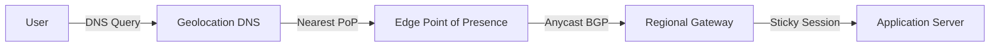
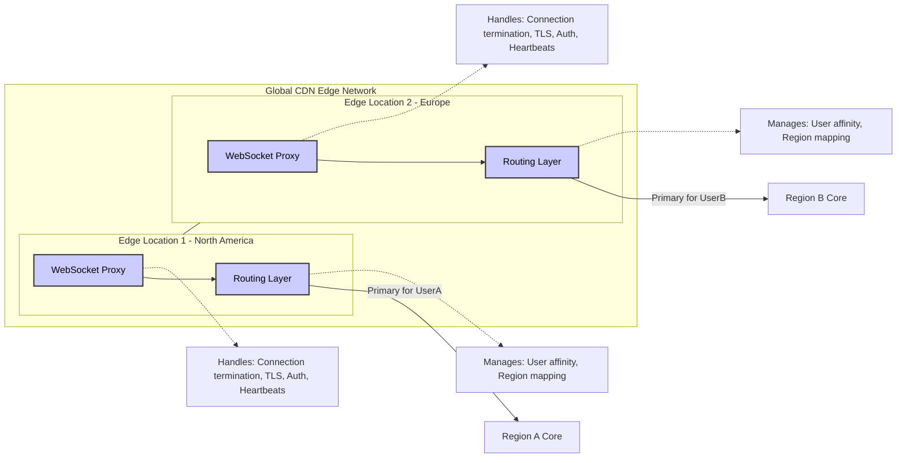
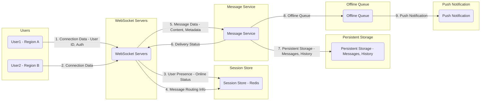

# Chat System Architecture

## Architecture Overview

This document details the architecture of a real-time chat system designed for global scale, low latency, and high availability. The system leverages a multi-region approach, edge computing, and robust load balancing strategies to ensure a seamless and reliable user experience.

The following diagram provides a high-level overview of the system architecture:

```mermaid
graph LR
    subgraph Client Layer
        Client1[Client 1]
        Client2[Client 2]
        style Client1 fill:#f9f,stroke:#333,stroke-width:2px,color:black
        style Client2 fill:#f9f,stroke:#333,stroke-width:2px,color:black
        Client1 -->|WebSocket+Fallback & E2E Encryption & Message Sequence #s| Edge
        Client2 -->|WebSocket+Fallback & E2E Encryption & Message Sequence #s| Edge
    end

    subgraph Global Load Balancers
        GLB[Global Load Balancers]
        GLB -->|DNS/Anycast Routing & Geo-based Distribution| Edge
        style GLB fill:#ccf,stroke:#333,stroke-width:2px,color:black
    end

    subgraph CDN Edge Location
        Edge[CDN Edge Location]
        Edge -->|WS Termination & TLS, Rate Limiting| RLB_A
        Edge -->|WS Termination & TLS, Rate Limiting| RLB_B
        style Edge fill:#ccf,stroke:#333,stroke-width:2px,color:black
    end

    subgraph Regional Load Balancers
        RLB_A[Regional L4/L7 LB]
        RLB_B[Regional L4/L7 LB]
        RLB_A -->|Connection Sticky & Health Checks| WSA1
        RLB_B -->|Connection Sticky & Health Checks| WSB1
        style RLB_A fill:#ccf,stroke:#333,stroke-width:2px,color:black
        style RLB_B fill:#ccf,stroke:#333,stroke-width:2px,color:black
    end

    subgraph WebSocket Servers
        WSA1[WS Server A1]
        WSB1[WS Server B1]
        WSA1 -->|Connection Pool & User Affinity| GSS
        WSB1 -->|Connection Pool & User Affinity| GSS
        style WSA1 fill:#ccf,stroke:#333,stroke-width:2px,color:black
        style WSB1 fill:#ccf,stroke:#333,stroke-width:2px,color:black
    end

    subgraph Global Session Store
        GSS[Global Session Store]
        style GSS fill:#ffe,stroke:#333,stroke-width:2px,color:black
    end

    subgraph Kafka Multi-Region
        Kafka[Kafka Multi-Region]
        WSA1 -->|Geo-Replicated Topics & Regional Consumer Groups & Cross-Region Sync| Kafka
        WSB1 -->|Geo-Replicated Topics & Regional Consumer Groups & Cross-Region Sync| Kafka
        style Kafka fill:#ccf,stroke:#333,stroke-width:2px,color:black
    end

    subgraph Message Service
        MsgService[Message Service]
        Kafka -->|Regional Routing & Region Failover & Sequence Ordering| MsgService
        style MsgService fill:#ccf,stroke:#333,stroke-width:2px,color:black
    end

    subgraph Offline Queue Service
        OfflineQueue[Offline Queue Service]
        MsgService -->|Regional Storage & Cross-Region Sync| OfflineQueue
        style OfflineQueue fill:#ccf,stroke:#333,stroke-width:2px,color:black
    end

    subgraph Authentication Service
        AuthService[Authentication Service]
        MsgService -->|Cross-Region Token Validation| AuthService
        style AuthService fill:#ccf,stroke:#333,stroke-width:2px,color:black
    end

    subgraph Search Service
        SearchService[Search Service]
        MsgService -->|Regional Indices & Cross-Region Queries| SearchService
        style SearchService fill:#ccf,stroke:#333,stroke-width:2px,color:black
    end

    subgraph REST API
        RestAPI[REST API]
        MsgService -->|Edge-Optimized & Regional Routes & Response Caching| RestAPI
        style RestAPI fill:#ccf,stroke:#333,stroke-width:2px,color:black
    end

    subgraph Monitoring System
        Monitoring[Monitoring System]
        MsgService -->|Health Checks & Failover Trigger & Latency Tracking| Monitoring
        style Monitoring fill:#ccf,stroke:#333,stroke-width:2px,color:black
    end

    subgraph Push Notification Service
        PushNotification[Push Notification Service]
        MsgService -->|FCM/APNS & Message Digest| PushNotification
        style PushNotification fill:#ccf,stroke:#333,stroke-width:2px,color:black
    end

    subgraph Multi-Region Database Layer
        DatabaseLayer[Multi-Region Database Layer]
        MessageStore[Message Store]
        UserGroupStore[User/Group Store]
        MediaStore[Media Store]
        MsgService --> DatabaseLayer
        SearchService --> DatabaseLayer
        RestAPI --> DatabaseLayer
        OfflineQueue --> DatabaseLayer
        DatabaseLayer --- MessageStore
        DatabaseLayer --- UserGroupStore
        DatabaseLayer --- MediaStore
        MessageStore -->|Regional Primaries & Read Replicas & Cross-Region Sync| DatabaseLayer
        UserGroupStore -->|Global Replication & Regional Replicas| DatabaseLayer
        MediaStore -->|CDN Edge Caching & Multi-Region Storage| DatabaseLayer
        style DatabaseLayer fill:#ffe,stroke:#333,stroke-width:2px,color:black
        style MessageStore fill:#ffe,stroke:#333,stroke-width:2px,color:black
        style UserGroupStore fill:#ffe,stroke:#333,stroke-width:2px,color:black
        style MediaStore fill:#ffe,stroke:#333,stroke-width:2px,color:black
    end
```

### Component Breakdown

The architecture is composed of several key components working in concert to deliver real-time chat functionality:

*   **Client Layer**:
    *   **WebSocket with Fallback**: Clients primarily connect using WebSockets for persistent, low-latency communication. In environments where WebSockets are not supported (e.g., due to network restrictions or older browsers), the system falls back to alternative techniques like long polling to maintain connectivity.
    *   **End-to-End (E2E) Encryption**: Messages are encrypted on the client-side before transmission and decrypted only on the recipient's client. This ensures privacy and security, preventing even the server from accessing message content.
    *   **Message Sequence Numbers**: Each message is assigned a unique sequence number to guarantee message ordering and enable reliable delivery, even in cases of network disruptions or out-of-order delivery.

*   **Global Load Balancers**:
    *   **DNS/Anycast Routing**:  Utilizes DNS-based or Anycast routing strategies to direct user connections to the geographically closest and healthiest edge location. This minimizes latency and improves the overall user experience.
    *   **Geo-based Distribution**:  Distributes traffic across different geographic regions to handle user connections efficiently and ensure regional isolation and fault tolerance.

*   **CDN Edge Location**:
    *   **WebSocket Termination**:  Content Delivery Network (CDN) edge servers are strategically placed around the world to terminate WebSocket connections close to users. This reduces latency and offloads connection management from core infrastructure.
    *   **TLS Termination**:  Handles TLS (Transport Layer Security) encryption and decryption at the edge, securing communication between clients and the system.
    *   **Rate Limiting**:  Implements rate limiting to protect the backend infrastructure from abuse and ensure fair usage of resources.
    *   **DDoS Protection**:  Provides initial protection against Distributed Denial of Service (DDoS) attacks at the network edge.

*   **Regional L4/L7 Load Balancers**:
    *   **Connection Stickiness**: Layer 4/Layer 7 load balancers within each region ensure that WebSocket connections from a user are consistently routed to the same WebSocket server. This "stickiness" is crucial for maintaining session state and user affinity.
    *   **Health Checks**:  Continuously monitor the health and availability of WebSocket servers within the region, allowing for automatic removal of unhealthy servers from the routing pool.

*   **WebSocket Servers**:
    *   **Connection Pool**:  Manages a pool of persistent WebSocket connections, efficiently handling a large number of concurrent users.
    *   **User Affinity**:  Maintains user affinity, ensuring that messages for a specific user are routed to the server instance that holds their active connection.

*   **Global Session Store**:
    *   **User-to-Region Mapping**:  Stores a global mapping of users to their assigned primary regions and WebSocket servers. This is essential for routing messages and managing user sessions across regions.
    *   **Failover Metadata**:  Contains metadata necessary for failover scenarios, enabling the system to quickly redirect users to backup regions in case of regional failures.

*   **Kafka Multi-Region**:
    *   **Geo-replicated Topics**:  Utilizes Kafka topics that are geo-replicated across regions. This ensures message durability and availability, even in the event of regional outages.
    *   **Regional Consumer Groups**:  Employs regional consumer groups to allow message processing to occur within each region, reducing cross-region latency.
    *   **Cross-Region Sync**:  Facilitates synchronization of messages and data across regions, ensuring data consistency and enabling cross-region communication.

*   **Message Service**:
    *   **Regional Routing**:  Responsible for routing messages within a region to the appropriate recipients based on user affinity and session information.
    *   **Region Failover**:  Handles message routing during regional failovers, ensuring messages are redirected to backup regions if necessary.
    *   **Sequence Ordering**:  Enforces message sequence ordering based on the sequence numbers assigned by clients, guaranteeing that messages are processed and delivered in the correct order.

*   **Offline Queue Service**:
    *   **Regional Storage**:  Provides regional storage for messages destined for offline users. This ensures messages are persisted until the recipient comes online.
    *   **Cross-region Sync**:  Synchronizes offline queues across regions for redundancy and failover purposes.

*   **Authentication Service**:
    *   **Cross-region Token Validation**:  Provides a globally accessible authentication service that can validate user tokens across all regions, ensuring consistent authentication and authorization.

*   **Search Service**:
    *   **Regional Indices**:  Maintains regional search indices for messages, allowing for efficient searching within a specific geographic area.
    *   **Cross-region Queries**:  Supports cross-region queries to enable searching across the entire message history, even if messages are distributed across regions.

*   **REST API**:
    *   **Edge-Optimized**:  Provides a REST API optimized for edge locations, offering efficient access to chat functionalities.
    *   **Regional Routes**:  Offers regional API routes to ensure requests are handled within the user's region, minimizing latency.
    *   **Response Caching**:  Implements response caching to improve API performance and reduce load on backend services.

*   **Monitoring System**:
    *   **Health Checks**:  Continuously monitors the health of all system components, providing real-time insights into system status.
    *   **Failover Trigger**:  Automatically triggers failover mechanisms in response to detected failures or performance degradation.
    *   **Latency Tracking**:  Tracks latency across different regions and components to identify performance bottlenecks and optimize message delivery speed.

*   **Push Notification Service**:
    *   **FCM/APNS**:  Integrates with Firebase Cloud Messaging (FCM) for Android and Apple Push Notification Service (APNS) for iOS to deliver push notifications to users when they are offline or when new messages arrive.
    *   **Message Digest**:  Includes a message digest or summary in push notifications to provide users with a preview of new messages without fully decrypting them on potentially insecure notification systems.

*   **Multi-Region Database Layer**:
    *   **Message Store**:
        *   **Regional Primaries**:  Employs regional primary databases for message storage to minimize write latency and ensure data locality.
        *   **Read Replicas**:  Utilizes read replicas within each region to handle read-heavy workloads and improve read performance.
        *   **Cross-region Sync**:  Synchronizes message data across regions to maintain data consistency and enable disaster recovery.
    *   **User/Group Store**:
        *   **Global Replication**:  Replicates user and group data globally to ensure consistent user information is available across all regions.
        *   **Regional Replicas**:  Provides regional replicas for faster read access to user and group data within each region.
    *   **Media Store**:
        *   **CDN Edge Caching**:  Caches media files (images, videos, etc.) at CDN edge locations for faster delivery to users.
        *   **Multi-region Storage**:  Stores media files in a multi-region storage system to ensure data durability and availability.

## Load Balancing Strategy

The architecture employs a multi-layered load balancing strategy to distribute traffic efficiently and ensure high availability at each level of the system.

### 1. Global Load Balancing (DNS/Anycast)

*   **Technology Options**:  Popular options include AWS Global Accelerator, Cloudflare Anycast, and Google Cloud Load Balancing. These services are designed for global traffic management and routing.
*   **Function**:  The primary function of global load balancing is to direct user traffic to the optimal entry point into the chat system's infrastructure. This is achieved by routing users to the nearest available edge location based on several factors:
    *   **Geographic Proximity**:  Users are routed to the edge location closest to their physical location to minimize network latency.
    *   **Current Regional Health**:  The global load balancer monitors the health of each region. If a region becomes unhealthy or experiences performance issues, traffic is automatically shifted away from that region.
    *   **User's Regional Affinity Settings**:  In some cases, users may have regional preferences (e.g., for data residency reasons). The global load balancer can take these settings into account when routing traffic.
*   **Implementation**:
    *   **DNS-based Routing with Health Checks**:  DNS records are configured to resolve to different edge locations based on geographic location. Health checks are integrated to automatically update DNS records and reroute traffic away from failing locations.
    *   **IP Anycast for Network-Level Routing**:  Anycast allows multiple servers in different locations to share the same IP address. Network routing protocols automatically direct traffic to the nearest healthy server advertising that IP address.
    *   **Geolocation-based Routing Decisions**:  The global load balancer uses geolocation databases to determine the user's location based on their IP address and make routing decisions accordingly.

### 2. Edge Load Balancing

*   **Technology Options**:  CDN edge servers themselves often come with built-in load balancing capabilities. Services like Cloudflare, AWS CloudFront, and Fastly offer edge load balancing as part of their CDN offerings.
*   **Function**: Edge load balancing operates within each CDN edge location and handles several critical functions:
    *   **TLS Connection Termination**:  Decrypts incoming TLS connections, offloading this computationally intensive task from backend servers.
    *   **WebSocket Initiation Handling**:  Manages the initial handshake and setup of WebSocket connections from clients.
    *   **Rate Limiting and DDoS Protection**:  Applies rate limiting to prevent abuse and provides a first line of defense against DDoS attacks by filtering out malicious traffic patterns at the edge.
    *   **Routing to Regional WebSocket Farms**:  Distributes incoming WebSocket connections across the pool of regional WebSocket servers within the same geographic region.
*   **Implementation**:
    *   **WebSocket-aware Load Balancers**:  Edge load balancers are specifically designed to understand and handle WebSocket connections, maintaining persistent connections and routing messages appropriately.
    *   **Connection Draining for Graceful Server Updates**:  Implements connection draining, allowing for graceful removal of WebSocket servers for updates or maintenance without abruptly disconnecting users. New connections are directed to other servers, while existing connections are allowed to complete before the server is taken offline.

### 3. Regional Load Balancing (L4/L7)

*   **Technology Options**:  Common regional load balancing solutions include AWS NLB/ALB, HAProxy, NGINX, and Envoy. These are robust load balancers designed for managing traffic within a data center or region.
*   **Function**: Regional load balancers operate within each geographic region and are responsible for:
    *   **Managing Connections to WebSocket Servers**:  Distributing WebSocket connections across the backend WebSocket server instances within the region.
    *   **Ensuring Sticky Sessions for WebSocket Connections**:  Maintaining session stickiness to ensure that a user's WebSocket connection is consistently routed to the same backend server throughout their session. This is important for maintaining connection state and user affinity.
    *   **Performing Health Checks on WebSocket Servers**:  Actively monitoring the health of backend WebSocket servers and removing unhealthy instances from the load balancing pool.
    *   **Facilitating Graceful Failover**:  Enabling seamless failover by automatically redirecting traffic to healthy servers if a server instance fails.
*   **Implementation**:
    *   **L4 (TCP) Load Balancing for Long-Lived Connections**:  Layer 4 load balancing is often preferred for WebSocket connections due to its efficiency in handling long-lived TCP connections.
    *   **Connection Hash-based Persistence**:  Uses connection hashing to ensure session stickiness. The load balancer uses a hash of the connection details (e.g., source IP, port) to consistently route traffic to the same backend server.
    *   **Active Health Monitoring**:  Regularly sends health check probes to backend WebSocket servers to verify their availability and responsiveness.
    *   **Configurable Timeout Settings Optimized for WebSockets**:  Load balancer timeouts are configured to be appropriate for WebSocket connections, which are expected to be long-lived and may have periods of inactivity.

### 4. Service Mesh Load Balancing

*   **Technology Options**: Service mesh technologies like Linkerd, Istio, and Consul Connect provide advanced networking and load balancing capabilities within a microservices architecture.
*   **Function**: Service mesh load balancing is used for internal service-to-service communication within the regional Kubernetes clusters:
    *   **Service-to-Service Communication**:  Manages and secures communication between different microservices within the chat system (e.g., Message Service, Authentication Service, etc.).
    *   **Internal Load Balancing**:  Provides load balancing for requests between services, distributing traffic across instances of a service.
    *   **Traffic Splitting for Gradual Rollouts**:  Enables canary deployments and blue/green deployments by allowing gradual traffic shifting to new versions of services.
    *   **Circuit Breaking for Fault Tolerance**:  Implements circuit breaker patterns to prevent cascading failures. If a service instance becomes unhealthy, the service mesh can temporarily stop sending traffic to it, preventing further issues.
*   **Implementation**:
    *   **Request-Level Load Balancing**:  Service meshes typically operate at Layer 7 (HTTP/gRPC), providing request-level load balancing and more intelligent routing decisions compared to Layer 4 load balancing.
    *   **Automatic Retries with Backoff**:  Automatically retries failed requests with exponential backoff, improving resilience to transient network issues or service hiccups.
    *   **Latency-Aware Routing**:  Some service meshes can perform latency-aware routing, directing traffic to service instances with the lowest latency.
    *   **Fault Injection for Testing**:  Service meshes often provide fault injection capabilities, allowing developers to simulate failures and test the resilience of the system.

### 5. Database Load Distribution

*   **Function**: Database load distribution is critical for handling the high read and write loads of a real-time chat system. The key functions include:
    *   **Read/Write Splitting**:  Directing read operations to read replicas and write operations to primary databases. This significantly improves read performance and scalability.
    *   **Sharding of Database Workloads**:  Dividing the database into shards based on user or conversation IDs. This distributes the data and workload across multiple database instances, improving scalability and reducing contention.
    *   **Cache Distribution**:  Using distributed caching layers (like Redis) to cache frequently accessed data, such as user profiles, active sessions, and recent messages. This reduces database load and improves response times.
*   **Implementation**:
    *   **Read Replicas in Each Region**:  Deploying read replicas of databases within each region to serve read requests locally, minimizing latency and cross-region traffic.
    *   **Connection Pooling**:  Using connection pooling on application servers to efficiently manage database connections and reduce the overhead of establishing new connections for each request.
    *   **Query Routing Based on Operation Type**:  Application logic or database proxies route queries to the appropriate database instance (primary for writes, replica for reads) based on the type of operation.

## System Components - Detailed Explanation

### Client Layer

The client layer is the entry point for users to interact with the chat system. It's responsible for providing a rich user experience while ensuring security and reliability even under varying network conditions.

*   **E2E Encrypted Messaging**:
    *   **Purpose**: To ensure user privacy and data confidentiality. Messages are encrypted on the sender's device and can only be decrypted by the intended recipient's device.
    *   **Details**:  Employs robust encryption algorithms (like AES-256 or ChaCha20) and key exchange protocols (like Diffie-Hellman or Signal Protocol). Encryption happens before messages leave the client device and decryption occurs only after they reach the recipient's device. The server infrastructure only handles encrypted payloads, preventing server-side access to message content.
*   **Sequence Numbering for Ordering**:
    *   **Purpose**: To guarantee message order, especially important in real-time chats where messages must be displayed chronologically, even if network delivery is not strictly in-order.
    *   **Details**: Each message sent by a client is assigned a unique, sequential number. The receiving client uses these sequence numbers to reassemble messages in the correct order, even if they arrive out of sequence due to network jitter or routing. This also helps in detecting and handling message loss or duplication.
*   **Offline Queue for Pending Messages**:
    *   **Purpose**: To ensure message delivery even when the recipient is offline or temporarily disconnected.
    *   **Details**: When a user sends a message to an offline recipient, the client queues the message locally. Upon reconnection, the client automatically attempts to resend these queued messages, ensuring no message is lost due to temporary disconnections. This client-side queue complements the server-side offline queue.
*   **Automatic Reconnection with Exponential Backoff**:
    *   **Purpose**: To handle network interruptions gracefully and automatically re-establish connections without user intervention.
    *   **Details**: If a client's connection is lost, the client automatically attempts to reconnect. Exponential backoff is used to manage reconnection attempts, starting with short intervals and increasing the interval after each failed attempt. This prevents overwhelming the server with reconnection requests during widespread network issues and conserves client device battery.

### Edge WebSocket Layer

The Edge WebSocket Layer is the system's front line, residing within the CDN edge network. It's designed to be geographically close to users, optimizing for latency and providing essential edge processing.

*   **WebSocket Connection Termination Near Users**:
    *   **Purpose**: To minimize latency by terminating WebSocket connections at CDN edge locations geographically close to users.
    *   **Details**: CDN edge servers act as the initial point of contact for client WebSocket connections. This reduces the round-trip time for initial connection establishment and subsequent message exchanges, as data travels shorter distances.
*   **Initial Message Validation and Rate Limiting**:
    *   **Purpose**: To protect backend infrastructure from malformed requests and abuse.
    *   **Details**: Edge servers perform basic validation of incoming messages to ensure they conform to expected formats and protocols. Rate limiting is applied at the edge to prevent individual clients or IP addresses from overwhelming the system with excessive requests, mitigating potential denial-of-service attacks and ensuring fair resource allocation.
*   **Connection Maintenance (Heartbeats, Keepalives)**:
    *   **Purpose**: To actively monitor connection health and detect broken or idle connections promptly.
    *   **Details**: Edge servers and clients exchange heartbeat or keepalive messages at regular intervals. If heartbeats are missed, the connection is considered broken and is closed, prompting reconnection attempts. This ensures efficient resource utilization by cleaning up dead connections and providing timely feedback on connection status.
*   **Protocol Upgrades (WebSocket, HTTP/2)**:
    *   **Purpose**: To support modern communication protocols for improved performance and efficiency.
    *   **Details**: Edge servers handle protocol upgrades, allowing clients to connect using the most efficient protocol supported by both the client and the server. This typically involves negotiating upgrades from HTTP/1.1 to HTTP/2 or establishing WebSocket connections directly. HTTP/2 offers features like multiplexing and header compression, while WebSockets provide full-duplex communication channels.

### Regional WebSocket Servers

Regional WebSocket Servers are the core connection management components, located within regional data centers. They handle persistent connections and message routing within a region.

*   **Persistent Connection Management**:
    *   **Purpose**: To maintain long-lived WebSocket connections with clients, enabling real-time bidirectional communication.
    *   **Details**: These servers are designed to handle a massive number of concurrent, persistent WebSocket connections. They efficiently manage connection state, track active users, and ensure connections remain open and available for immediate message exchange.
*   **User-to-Connection Mapping**:
    *   **Purpose**: To efficiently route messages to the correct recipient by maintaining a mapping between user IDs and their active WebSocket connections.
    *   **Details**: Each WebSocket server maintains a local cache or accesses a shared data store (like the Global Session Store) to track which users are connected to it. When a message arrives, the server quickly looks up the recipient's connection based on their user ID and routes the message accordingly.
*   **Message Routing and Fan-Out**:
    *   **Purpose**: To direct messages to the intended recipients within the region and efficiently handle group chats or broadcast scenarios.
    *   **Details**: When a message is received, the WebSocket server determines the recipients. For direct messages, it routes the message to the recipient's connection (if in the same region). For group chats or broadcast messages, it performs fan-out, sending copies of the message to all connected members of the group or subscribers. This routing logic is optimized for low latency and high throughput.
*   **Connection State Monitoring**:
    *   **Purpose**: To track the health and status of individual WebSocket connections, allowing for proactive detection of issues and resource management.
    *   **Details**: WebSocket servers actively monitor the state of each connection, tracking metrics like connection uptime, message latency, and potential errors. This monitoring data is used for health checks, performance analysis, and triggering alerts if connections become unstable or unhealthy.

### Global Session Store

The Global Session Store is a globally accessible, highly available data store responsible for managing user session information and regional affinity.

*   **Active-Active Redis Clusters**:
    *   **Purpose**: To provide a fast, scalable, and highly available data store for session information. Redis is chosen for its in-memory data storage, low latency, and support for clustering and replication. Active-active setup ensures continuous operation even if some nodes fail.
    *   **Details**: Employs multiple Redis clusters deployed in an active-active configuration across different availability zones or regions. Data is replicated across these clusters to ensure redundancy and fault tolerance. Load balancers distribute read and write operations across the active Redis instances.
*   **User Presence Information**:
    *   **Purpose**: To track the online/offline status of users in real-time, enabling presence indicators in the chat application and informing message routing decisions.
    *   **Details**: The session store maintains the current online status of each user. WebSocket servers update this status upon user connection and disconnection. This information is used by the Message Service to determine if a recipient is online for direct message delivery or if the message should be queued for offline delivery.
*   **Connection Mapping (User → Region/Server)**:
    *   **Purpose**: To globally track which region and specific WebSocket server instance is currently handling a user's active connection.
    *   **Details**: When a user connects, the assigned WebSocket server registers the user's ID and its own region/server identifier in the Global Session Store. This mapping is crucial for cross-region message routing. When a message needs to be delivered to a user, the system consults this mapping to determine the correct region and server to forward the message to.
*   **Failover Configuration**:
    *   **Purpose**: To store metadata and configurations necessary for regional failover, ensuring a smooth transition in case of regional outages.
    *   **Details**: The session store contains failover configurations, such as backup regions for each primary region, health check endpoints, and routing rules. In a failover scenario, this metadata is used to quickly update routing configurations and redirect user traffic to healthy regions.

### Message Processing Layer

The Message Processing Layer is responsible for handling the core message processing logic, including routing, ordering, and delivery guarantees.

*   **Regional Message Processing**:
    *   **Purpose**: To process messages within the region where they are initially received, reducing cross-region dependencies and latency.
    *   **Details**: Message processing, including routing, sequence validation, and some business logic, is primarily handled within the region where the sender's WebSocket connection is established. This keeps message processing close to the users and reduces the need for cross-region communication for most operations.
*   **Cross-region Message Routing**:
    *   **Purpose**: To route messages efficiently to recipients who are connected in different regions.
    *   **Details**: When a message is destined for a user in a different region, the Message Service uses the Global Session Store to determine the recipient's region and forwards the message to the Message Service in that region via Kafka. This cross-region routing ensures global message delivery while maintaining regional processing for efficiency.
*   **Sequence Validation and Ordering**:
    *   **Purpose**: To validate message sequence numbers and enforce message ordering as defined by the client-assigned sequence numbers.
    *   **Details**: The Message Service validates the sequence numbers of incoming messages to detect any gaps or out-of-order delivery. It uses these sequence numbers to ensure that messages are processed and persisted in the correct order, even if they arrive at the server out of sequence.
*   **Idempotent Message Handling**:
    *   **Purpose**: To ensure that messages are processed exactly once, even in the presence of network retries or potential message duplication in the Kafka layer.
    *   **Details**: The Message Service implements idempotent message handling. Each message is assigned a unique ID. The Message Service tracks processed message IDs and ensures that if it receives the same message ID multiple times (due to retries or Kafka behavior), it processes the message only once, preventing duplicate actions or data corruption.

### Storage Layer

The Storage Layer is designed for scalability, durability, and regional optimization, using a multi-region database strategy.

*   **Regional Database Primaries**:
    *   **Purpose**: To minimize write latency and ensure data locality by having primary database instances within each geographic region.
    *   **Details**: For message storage (Message Store), each region has its own primary database instance that handles write operations for messages originating from users in that region. This reduces the latency for write operations and keeps data geographically closer to the users who generate it.
*   **Cross-region Replication**:
    *   **Purpose**: To ensure data durability, availability, and disaster recovery by replicating data across regions.
    *   **Details**: Data from regional primary databases is asynchronously replicated to databases in other regions. This cross-region replication provides redundancy in case of regional failures. If a region becomes unavailable, data can be recovered from replicas in other regions.
*   **Tiered Storage (Hot/Warm/Cold)**:
    *   **Purpose**: To optimize storage costs and performance by using different storage tiers based on data access frequency and age.
    *   **Details**:
        *   **Hot Storage**: Recent and frequently accessed messages are stored in high-performance storage (e.g., SSDs) for fast retrieval.
        *   **Warm Storage**: Older, less frequently accessed messages are moved to a less expensive storage tier (e.g., HDDs or cloud object storage) that still provides reasonable access times.
        *   **Cold Storage**:  Archival or very old messages, accessed rarely, are moved to the cheapest storage tier (e.g., archival cloud storage) for long-term retention and cost optimization.
*   **Sharded by User/Conversation**:
    *   **Purpose**: To improve database scalability and performance by partitioning data across multiple database shards.
    *   **Details**: The Message Store database is sharded, typically by user ID or conversation ID. This distributes the data and query load across multiple database instances, preventing any single database from becoming a bottleneck and improving overall system scalability. Sharding strategy is designed to keep related data (e.g., all messages for a specific conversation) within the same shard for query efficiency.

### Monitoring & Operations

Robust monitoring and operational capabilities are essential for maintaining the health and performance of a distributed real-time chat system.

*   **Health Checking All Components**:
    *   **Purpose**: To continuously monitor the health and availability of every component in the architecture, from edge servers to databases and message queues.
    *   **Details**: Comprehensive health checks are implemented for all services and infrastructure components. These checks monitor metrics like CPU usage, memory consumption, disk space, network latency, and application-specific health indicators. Automated alerts are triggered if any component becomes unhealthy or falls below performance thresholds.
*   **Latency Monitoring Between Regions**:
    *   **Purpose**: To track latency for cross-region communication and message delivery, identifying potential network bottlenecks or performance issues between regions.
    *   **Details**: Latency is measured for various cross-region interactions, such as message routing, database replication, and session store synchronization. Monitoring tools visualize these latency metrics, allowing operations teams to identify and diagnose cross-region performance problems.
*   **Automatic Failover Triggering**:
    *   **Purpose**: To automate the failover process in case of regional failures or service degradation, minimizing downtime and ensuring high availability.
    *   **Details**: The monitoring system is configured to automatically trigger failover mechanisms when critical components or entire regions become unhealthy. Failover logic is pre-defined and automated, allowing for rapid redirection of traffic to backup regions and failover of database primaries, minimizing service interruption.
*   **Traffic Visualization and Anomaly Detection**:
    *   **Purpose**: To provide real-time visibility into traffic patterns, identify anomalies, and assist in capacity planning and troubleshooting.
    *   **Details**: Monitoring dashboards visualize key traffic metrics, such as message throughput, connection counts, active users per region, and API request rates. Anomaly detection algorithms are applied to these metrics to automatically identify unusual traffic patterns that might indicate issues or security threats. This helps in proactive problem detection and capacity management.

## Edge WebSocket Implementation - Detailed View

This diagram illustrates the Edge WebSocket Implementation within the Global CDN Edge Network.

*   **Global CDN Edge Network**: Represents the globally distributed CDN infrastructure.
*   **Edge Locations (e.g., Edge Location 1, Edge Location 2)**:  These are geographically distributed points of presence within the CDN.  Examples are North America, Europe, Asia, etc.
*   **WebSocket Proxy**:
    *   Located within each Edge Location.
    *   Responsible for:
        *   **Connection Termination**:  Accepting and terminating WebSocket connections from clients.
        *   **TLS Handling**: Managing TLS encryption and decryption for secure communication.
        *   **Initial Authentication**:  Performing initial authentication steps, potentially validating user tokens or credentials.
        *   **Heartbeats**:  Exchanging heartbeat messages to maintain connection health.
*   **Routing Layer**:
    *   Also within each Edge Location.
    *   Responsible for:
        *   **User Affinity**:  Determining the user's primary region based on configuration or geolocation.
        *   **Region Mapping**:  Routing the WebSocket connection to the appropriate Regional Core based on user affinity.
*   **Region A Core (Primary for UserA), Region B Core (Primary for UserB)**: Represent the Regional Core infrastructure in different geographic regions, responsible for the core chat functionalities.

## Regional Affinity & Failover - Flowchart

```mermaid
graph LR
    UserConnect[User Connects] --> GlobalDNSCDN[Global DNS/ CDN Edge]
    GlobalDNSCDN --> UserAffinityService[User Affinity Service]
    UserAffinityService --> CheckRegionHealth[Check Region Health Status]
    CheckRegionHealth -- Primary Available --> RoutePrimaryRegion[Route to Primary Region]
    CheckRegionHealth -- Primary Down, Use Failover --> RoutePrimaryRegion
    CheckRegionHealth -- User Traveling, Use Closest --> RoutePrimaryRegion
    CheckRegionHealth -- New User, Assign --> RoutePrimaryRegion

    RoutePrimaryRegion --> UpdateSessionStore[Update Global Session Store]
    UpdateSessionStore --> ContinueMonitoring[Continue Monitoring]

    style UserConnect fill:#f9f,stroke:#333,stroke-width:2px,color:black
    style GlobalDNSCDN fill:#ccf,stroke:#333,stroke-width:2px,color:black
    style UserAffinityService fill:#ccf,stroke:#333,stroke-width:2px,color:black
    style CheckRegionHealth fill:#ccf,stroke:#333,stroke-width:2px,color:black
    style RoutePrimaryRegion fill:#ccf,stroke:#333,stroke-width:2px,color:black
    style UpdateSessionStore fill:#ffe,stroke:#333,stroke-width:2px,color:black
    style ContinueMonitoring fill:#ccf,stroke:#333,stroke-width:2px,color:black
```

This flowchart describes the Regional Affinity and Failover process:

1.  **User Connects**: A user initiates a connection to the chat system.
2.  **Global DNS/CDN Edge**: The connection request is initially handled by the Global DNS or CDN Edge network, directing the user to a nearby edge location.
3.  **User Affinity Service**: The Edge location contacts the User Affinity Service to determine the user's preferred or primary region.
4.  **Check Region Health Status**: Before routing, the system checks the health status of the determined primary region.
5.  **Decision Points based on Region Health**:
    *   **Primary Available**: If the primary region is healthy, the system proceeds to route the user to that region.
    *   **Primary Down, Use Failover**: If the primary region is down or unhealthy, the system uses pre-configured failover mechanisms to route the user to a backup or secondary region.
    *   **User Traveling, Use Closest**: If the user is detected as traveling (location change), the system may route them to the geographically closest healthy region for optimal latency.
    *   **New User, Assign**: For new users without a pre-defined primary region, the system assigns them to a region, potentially based on current load, geographic location, or other criteria.
6.  **Route to Primary Region**:  Based on the decision, the user's connection is routed to a Regional Core in the selected region.
7.  **Update Global Session Store**: The Global Session Store is updated to reflect the user's active session in the chosen region.
8.  **Continue Monitoring**: The system continues to monitor the health of all regions and user sessions, ready to trigger failover or re-routing if necessary.

## Offline Message Flow - Flowchart

```mermaid
graph LR
    User1Online["User1 (Online)"] --> EdgeWS_A["Edge WS (Region A)"]
    EdgeWS_A --> MessageService_A["Message Service (Region A)"]
    MessageService_A --> SessionStore["Session Store<br>&quot;User2 = Offline&quot;"]
    SessionStore --> MessageStore_AB["Message Store (Region A/B)"]
    MessageStore_AB --> OfflineQueue_B["Offline Queue (Region B)"]
    OfflineQueue_B --> PushNotification["Push Notification Service"]
    PushNotification --> User2Device["User2 Device<br>(Notification)"]
    User2Device --> User2Connects["User2 Connects to Edge WS (Region B)"]
    User2Connects --> SessionStoreOnline["Session Store<br>&quot;User2=Online&quot;"]
    SessionStoreOnline --> EdgeWSServer_B["Edge WS Server (Region B)"]
    EdgeWSServer_B --> MessageService_B["Message Service (Region B)"]
    MessageService_B --> OfflineQueue_B_2["Offline Queue (Region B)"]
    OfflineQueue_B_2 --> User2ReceivesMessages["User2 (now online)<br>receives messages"]

    %% Apply styling
    style User1Online fill:#f9f,stroke:#333,stroke-width:2px,color:black
    style User2Device fill:#f9f,stroke:#333,stroke-width:2px,color:black
    style User2Connects fill:#f9f,stroke:#333,stroke-width:2px,color:black
    style User2ReceivesMessages fill:#f9f,stroke:#333,stroke-width:2px,color:black
    style EdgeWS_A fill:#ccf,stroke:#333,stroke-width:2px,color:black
    style EdgeWSServer_B fill:#ccf,stroke:#333,stroke-width:2px,color:black
    style MessageService_A fill:#ccf,stroke:#333,stroke-width:2px,color:black
    style MessageService_B fill:#ccf,stroke:#333,stroke-width:2px,color:black
    style SessionStore fill:#ffe,stroke:#333,stroke-width:2px,color:black
    style SessionStoreOnline fill:#ffe,stroke:#333,stroke-width:2px,color:black
    style MessageStore_AB fill:#ffe,stroke:#333,stroke-width:2px,color:black
    style OfflineQueue_B fill:#ccf,stroke:#333,stroke-width:2px,color:black
    style OfflineQueue_B_2 fill:#ccf,stroke:#333,stroke-width:2px,color:black
    style PushNotification fill:#ccf,stroke:#333,stroke-width:2px,color:black
```

This flowchart details the flow of an offline message:

1.  **User1 (Online)**: User1, who is online, sends a message to User2.
2.  **Edge WS (Region A)**: User1's message is received by the Edge WebSocket server in Region A (User1's region).
3.  **Message Service (Region A)**: The Edge WebSocket server forwards the message to the Message Service within Region A.
4.  **Session Store "User2 = Offline"**: The Message Service checks the Global Session Store and finds that User2 is offline.
5.  **Message Store (Region A/B)**: The Message Service persists the message in the Message Store. The Message Store is multi-region, ensuring durability.
6.  **Offline Queue (Region B)**: The Message Service routes the message to the Offline Queue Service, likely in User2's primary region (Region B).
7.  **Push Notification Service**: The Offline Queue Service triggers the Push Notification Service to send a notification to User2's device.
8.  **User2 Device (Notification)**: User2's device receives a push notification alerting them to a new message.
9.  **User2 Connects to Edge WS (Region B)**: User2 opens the chat application and connects to the Edge WebSocket server, potentially in their primary region (Region B).
10. **Session Store "User2=Online"**: Upon User2's connection, the Session Store is updated to reflect User2's online status.
11. **Edge WS Server (Region B)**: User2's connection is established with an Edge WebSocket server in Region B.
12. **Message Service (Region B)**: The Edge WebSocket server informs the Message Service in Region B about User2's online status.
13. **Offline Queue (Region B)**: The Message Service in Region B retrieves pending offline messages for User2 from the Offline Queue Service.
14. **User2 (now online) receives messages**: User2's client, now online, receives the queued messages.

## Data Flow Diagram (DFD)

This Data Flow Diagram (DFD) illustrates the data flow within the real-time chat system:

1.  **Connection Data**: Users (User1, User2) initiate connections, sending connection data (User ID, Authentication credentials) to the WebSocket Servers.
2.  **Connection Data**: Similarly, User2 also sends connection data to the WebSocket Servers.
3.  **User Presence (Online status)**: WebSocket Servers update the Session Store (Redis) with user presence information, indicating online status.
4.  **Message Routing Info**: WebSocket Servers retrieve message routing information from the Session Store to direct messages correctly.
5.  **Message Data (Content, metadata)**: When a user sends a message, the WebSocket Servers forward the message data (content, metadata) to the Message Service.
6.  **Delivery Status**: The Message Service sends delivery status updates back to the WebSocket Servers to confirm message processing and delivery attempts.
7.  **Persistent Storage (Messages, history)**: The Message Service persists message data and history in the Persistent Storage layer.
8.  **Offline Queue**: For messages destined to offline users, the Message Service routes them to the Offline Queue.
9.  **Push Notification**: The Offline Queue triggers the Push Notification service to alert offline users about new messages.

## Deployment Strategy - Detailed Options

The deployment strategy is crucial for achieving the desired scalability, availability, and efficiency of the real-time chat system. It involves choices for both Edge WebSocket Infrastructure and Regional Kubernetes Clusters.

### Edge WebSocket Infrastructure Deployment Options

1.  **CDN-based Edge Deployment**: Leveraging the existing infrastructure of a Content Delivery Network (CDN) for deploying the Edge WebSocket layer.
    *   **Cloudflare Workers**:
        *   **Pros**: Serverless, globally distributed, excellent performance, pay-as-you-go pricing, integrated DDoS protection, easy to deploy and manage.
        *   **Cons**:  Execution time limits, cold starts (though minimized), vendor lock-in, might have limitations on long-lived WebSocket connections compared to dedicated servers (though improving).
        *   **Use Cases**: Ideal for handling WebSocket termination, TLS, initial authentication, and basic routing at the edge. Best for scenarios prioritizing ease of deployment, global reach, and cost-effectiveness.
    *   **AWS Lambda@Edge + API Gateway WebSocket support**:
        *   **Pros**: Serverless, integrated with AWS ecosystem, globally distributed via CloudFront, pay-per-execution, good for event-driven edge logic. API Gateway provides WebSocket management features.
        *   **Cons**: Lambda execution time limits, potential cold starts, more complex setup compared to CDN workers, API Gateway can add some latency.
        *   **Use Cases**: Suitable for AWS-centric deployments, where tight integration with other AWS services is beneficial. Good for edge processing that fits within Lambda's execution model.
    *   **Fastly Compute@Edge**:
        *   **Pros**: Serverless, high-performance CDN, designed for compute-intensive edge applications, fine-grained control, lower cold starts compared to some serverless functions, good for complex edge logic.
        *   **Cons**:  Can be more complex to configure than simpler CDN workers, might be more expensive for very basic edge tasks.
        *   **Use Cases**:  Excellent for scenarios requiring more sophisticated edge processing, custom routing logic, or performance-critical WebSocket handling at the CDN edge.

2.  **Lightweight Edge Kubernetes**: Deploying a lightweight Kubernetes distribution at edge locations.
    *   **K3s**:
        *   **Pros**: Lightweight Kubernetes distribution, low resource footprint, easy to install and manage, suitable for resource-constrained edge environments, good for running containerized WebSocket proxies.
        *   **Cons**:  Smaller community compared to full Kubernetes, might lack some advanced features of full Kubernetes, requires managing edge nodes and Kubernetes cluster.
        *   **Use Cases**:  Ideal for edge locations where more control over the environment is needed than serverless CDN functions offer, but resources are still limited. Good for telco edge, on-premise edge, or private CDN edge deployments.
    *   **MicroK8s**:
        *   **Pros**:  Lightweight Kubernetes from Canonical (Ubuntu), simple to install (especially on Ubuntu), single-node or multi-node clusters, includes many add-ons, good for development and edge scenarios.
        *   **Cons**:  Still requires managing Kubernetes nodes, might be slightly heavier than K3s, potentially more overhead than serverless CDN options.
        *   **Use Cases**: Similar to K3s, suitable for edge deployments needing more control and container orchestration at the edge, particularly in environments favoring Ubuntu/Canonical ecosystem.
    *   **AWS Wavelength/Azure Edge Zones for mobile edge presence**:
        *   **Pros**:  Cloud provider managed edge zones, ultra-low latency access to cloud services from edge locations, integrated with cloud ecosystems, designed for mobile edge computing.
        *   **Cons**:  Vendor-specific (AWS or Azure), geographically limited to edge zones offered by the cloud provider, can be more expensive than self-managed edge deployments.
        *   **Use Cases**: Best for applications requiring extremely low latency for mobile users, such as real-time gaming, AR/VR, or applications needing to process data very close to mobile devices.

### Regional Kubernetes Clusters - Deployment Details

Kubernetes is used for orchestrating the core services within each region, providing scalability, resilience, and manageability.

1.  **Global Kubernetes Federation**: For managing multiple regional Kubernetes clusters as a single logical unit.
    *   **Multi-cluster management tools**:
        *   **Kubernetes Federation v2 (KubeFed)**:  Open-source, allows synchronizing resources and configurations across multiple Kubernetes clusters.
        *   **Rancher Fleet**:  Open-source, GitOps-based multi-cluster management, designed for large fleets of clusters.
        *   **Google Anthos/AWS EKS Anywhere/Azure Arc**:  Cloud provider solutions for hybrid and multi-cloud Kubernetes management, offering centralized control and policy enforcement.
    *   **Global policy enforcement**:  Enforce consistent policies (security, resource quotas, etc.) across all regional clusters from a central control plane.
    *   **Cross-cluster service discovery**:  Enable services in different regional clusters to discover and communicate with each other, facilitating cross-region functionalities.

2.  **Regional Kubernetes Clusters**: Dedicated Kubernetes clusters are deployed in each geographic region.
    *   **Each geographic region has dedicated cluster(s)**:  Regional isolation for fault containment and independent scaling. May involve multiple clusters per region for further workload separation or redundancy.
    *   **Namespace separation by service type**:  Use Kubernetes namespaces to logically separate different service types (e.g., 'websocket-servers', 'message-processing', 'databases') within each cluster, improving organization and resource management.
    *   **Custom resource definitions for chat-specific resources**:  Extend Kubernetes API with Custom Resource Definitions (CRDs) to manage chat-specific resources like chat channels, user groups, or message queues in a Kubernetes-native way.

3.  **Specialized Workload Types**: Kubernetes offers different workload types optimized for various application needs.
    *   **Deployments**: For stateless services like API servers, message processors, and authentication services. Deployments ensure desired number of replicas are running and handle rolling updates.
    *   **StatefulSets**: For ordered, stateful services requiring persistent storage and stable network identities, such as Kafka clusters, database clusters (primary instances), and Redis clusters. StatefulSets manage scaling, ordering, and persistent volumes for stateful applications.
    *   **DaemonSets**: For per-node services that need to run on every (or specific) node in the cluster, like monitoring agents, logging collectors, or network proxies.
    *   **Jobs/CronJobs**: For batch jobs, maintenance tasks, cleanup processes, reporting, and scheduled tasks. Jobs run to completion, while CronJobs run on a schedule.

4.  **Kubernetes Resource Management**: Efficiently manage compute resources within Kubernetes.
    *   **Resource requests/limits based on workload type**:  Define resource requests and limits for each container based on its workload characteristics. WebSocket servers (Guaranteed QoS) might get higher resource guarantees than background processes (Burstable QoS) or utility services (BestEffort QoS).
    *   **Quality of Service (QoS) classes**:
        *   **Guaranteed QoS**: For critical, latency-sensitive workloads like WebSocket servers. Pods get reserved CPU and memory.
        *   **Burstable QoS**: For background processes, message processors. Pods can burst above their resource requests if resources are available.
        *   **BestEffort QoS**: For utility services, less critical tasks. Pods have no resource guarantees and might be evicted first under resource pressure.
    *   **Node affinity/anti-affinity for failure domain separation**:  Use node affinity and anti-affinity rules to control pod placement on Kubernetes nodes. For example, spread WebSocket servers across different nodes and availability zones for fault tolerance. Anti-affinity can prevent co-locating replicas of the same service on the same node.

5.  **Auto-scaling Configuration**: Automatically adjust the number of pods and cluster nodes based on load.
    *   **Horizontal Pod Autoscaler (HPA)**: Automatically scales the number of pods in a Deployment or StatefulSet based on observed metrics.
        *   **Scaling metrics**:
            *   **WebSocket connection count**: Scale WebSocket server Deployments based on the number of active client connections.
            *   **Message throughput**: Scale Message Processing services based on message processing rate or queue lengths.
            *   **CPU/Memory utilization**: Standard CPU and memory utilization metrics for general auto-scaling.
    *   **Cluster Autoscaler**: Automatically scales the number of nodes in the Kubernetes cluster based on resource needs of pods. If HPA needs to scale up pods, but there's not enough capacity in the cluster, Cluster Autoscaler can add more nodes.
    *   **Custom metrics adapters for chat-specific scaling triggers**:  Implement custom metrics adapters to expose chat-specific metrics to the HPA and Cluster Autoscaler. This allows scaling to be driven by application-level metrics beyond CPU/memory, such as message latency, queue depth, or user activity levels.

6.  **Deployment Strategies**: Implement robust deployment strategies for updates and new feature rollouts.
    *   **Rolling updates with minimal disruption**: Kubernetes Rolling Updates strategy updates Deployments and StatefulSets gradually, replacing pods one by one, ensuring minimal service interruption during updates.
    *   **Blue/Green deployments for zero-downtime updates**:  Create two identical environments (blue and green). Deploy new version to the green environment, test it, and then switch traffic from blue to green for zero-downtime releases.
    *   **Canary deployments for new features**:  Gradually roll out new features to a small subset of users (canary users) to test in production before wider release. Traffic splitting in the service mesh can facilitate canary deployments.

## Industry Implementation Examples - Real-world Architectures

Examining how industry leaders implement real-time chat provides valuable insights into practical architectural choices.

1.  **Discord's Approach**: Known for its massive scale and real-time voice and text chat for communities.
    *   **Elixir/Erlang for WebSocket servers at edge**: Discord heavily uses Elixir and Erlang, languages renowned for their concurrency and fault-tolerance, for building their WebSocket servers that handle millions of concurrent connections at the edge.
    *   **Assigns users to "guilds" (servers) with regional affinity**: Discord organizes users into "guilds" (communities or servers). Users within a guild are often regionally co-located to reduce latency for communication within the guild.
    *   **Employs "cellular" architecture where related users share infrastructure**: Discord uses a cellular architecture.  Users who frequently interact (members of the same guild) are placed in the same "cell" or infrastructure unit. This minimizes latency for communication within close-knit groups and optimizes resource utilization by grouping related users.

2.  **WhatsApp's Approach**: Focuses on mobile messaging with end-to-end encryption and global reach.
    *   **Edge servers handle connection maintenance**: WhatsApp utilizes edge servers to manage connection establishment, keep-alives, and some protocol-level processing, offloading these tasks from core servers.
    *   **Uses consistent hashing for user-to-server assignment**: WhatsApp likely employs consistent hashing to assign users to backend servers. Consistent hashing ensures that when servers are added or removed, only a minimal number of user-to-server mappings need to change, reducing disruption and data reshuffling.
    *   **Employs custom binary protocols for minimal overhead**: WhatsApp uses custom-designed binary protocols for communication instead of standard text-based protocols like HTTP. Binary protocols are more compact and efficient, reducing bandwidth usage, which is crucial for mobile networks and global scale.

3.  **Slack's Approach**: Designed for workplace collaboration, emphasizing reliability and features for team communication.
    *   **Regional WebSocket farms with sticky load balancing**: Slack uses regional deployments with farms of WebSocket servers in each region. Sticky load balancing is crucial to maintain user sessions and ensure messages are routed to the correct server instance within a region.
    *   **Workspace-based sharding with regional affinity**: Slack shards its data and infrastructure based on "workspaces" (organizations). Workspaces are likely assigned to primary regions to maintain data locality and potentially improve performance for users within a workspace.
    *   **Gradual rollback to primary regions after failover**: In case of regional failover, Slack likely has mechanisms for gradual rollback to primary regions once they recover. This involves carefully shifting traffic back to the primary region while ensuring stability and preventing cascading issues during the recovery process.
